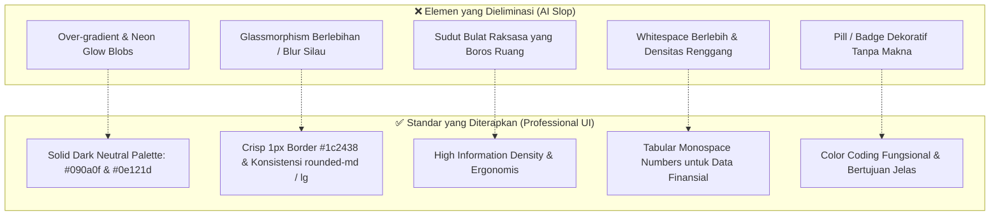

# 📐 Konsep & Filosofi Desain: IDX Swing Analyzer

Dokumen ini menjelaskan fondasi, filosofi desain, visual tokens, hierarki komponen, dan prinsip UX yang diterapkan pada antarmuka **IDX Swing Analyzer**.

---

## 1. Filosofi Desain: *Anti-AI Design Slop & Professional Terminal UI*

Aplikasi ini sengaja menghindari tren desain generik kecerdasan buatan (*AI Design Slop*) dan mengadopsi standar **Professional Financial Product UI** yang terinspirasi oleh platform trading institusional dan software produktivitas kelas dunia (*TradingView, Bloomberg Terminal, Linear, Raycast, Vercel*).



### Prinsip Utama Desain:
1. **Utamakan Usabilitas (*Utility-First*)**: Setiap piksel dan elemen visual harus memiliki fungsi analitis atau eksekusi bagi trader.
2. **Kepadatan Informasi Terstruktur (*High Scan-Friendly Density*)**: Pasar bergerak cepat; trader membutuhkan informasi harga, level support/resistance, rasio risiko, dan sinyal teknikal dalam satu pandangan tanpa harus banyak scroll.
3. **Penyajian Data Berbasis Angka Presisi (*Tabular Alignment*)**: Seluruh nominal Rupiah dan angka persentase menggunakan format `tabular-nums` agar tidak ada pergeseran visual (*layout shift*) saat data diperbarui.
4. **Transparansi Sumber Data (*Zero-Confusion UX*)**: Pengguna dapat membedakan secara instan mana data matematis bursa yang mutlak (*deterministic math*) dan mana sintesis narasi dari AI.

---

## 2. Sistem Warna Semantik (*Visual Tokens*)

Warna digunakan secara disiplin dan hemat. Tidak ada warna mencolok yang digunakan hanya sebagai hiasan.

| Kategori | Token / Hex | Makna & Penggunaan |
|---|---|---|
| **App Canvas** | `#090a0f` | Background dasar aplikasi, gelap pekat, ramah mata untuk sesi trading panjang |
| **Surface Card** | `#0e121d` | Latar belakang kartu analitis utama dengan kontras halus |
| **Nested Surface** | `#090c14` / `#101420` | Sub-kontainer / input form / modul metrik internal |
| **Border Subtle** | `#1c2438` | Border pembatas 1px yang tegas dan presisi antar kartu |
| **Border Active** | `#38bdf8` / `#0284c7` | Border fokus input, active tab, dan selektor ticker |
| 🟢 **Profit / Buy** | `#10b981` / `#34d399` | Sinyal beli, level Support, TP1 & TP2, profit estimasi, Bullish trend |
| 🔴 **Risk / Cut Loss** | `#f43f5e` / `#ef4444` | Skenario Cut Loss, level Resistance, Downtrend, peringatan risiko |
| 🟡 **Alert / Energy** | `#f59e0b` / `#fbbf24` | EMA 20, Volume Surge, Bollinger Squeeze Alert, status Moderat |
| 🟣 **Baseline Trend** | `#a855f7` | EMA 200 (Garis tren jangka panjang), RSI Momentum |
| 🔵 **Primary Sky** | `#38bdf8` | Highlight navigasi, EMA 50, dan tombol aksi utama |

---

## 3. Tipografi & Hirarki Konten

* **Font Utama UI**: `-apple-system, BlinkMacSystemFont, "Segoe UI", Roboto, sans-serif` (Optimal, tajam, dan tidak memberatkan *loading bundle*).
* **Font Finansial & Data**: `font-mono tabular-nums` (Digunakan pada seluruh harga saham, fraksi harga BEI, volume lot, dan persentase profit/loss).
* **Ukuran & Bobot**:
  * **Hero Header / Ticker**: `text-2xl` s/d `text-3xl font-bold tracking-tight text-white`
  * **Sub-Header / Label Metrik**: `text-xs font-semibold text-slate-300`
  * **Keterangan / Context Text**: `text-[11px] text-slate-400`
  * **Micro-Data / Timestamp**: `text-[10px] text-slate-500 font-mono`

---

## 4. Cetak Biru Tata Letak (*Layout Architecture*)

Tata letak disusun secara hierarkis mengikuti alur kerja berpikir seorang *swing trader*:

```
┌─────────────────────────────────────────────────────────────────────────────┐
│ 1. HEADER: Search Ticker (BBCA, MEDC) | Quick Chips | Status Engine (AI/Algo)│
├─────────────────────────────────────────────────────────────────────────────┤
│ 2. TOP DASHBOARD (Grid 2 Kolom):                                           │
│    [ Left: SCORECARD (Harga, 52W Bar, Trend, RSI, Stoch, S/R Levels) ]      │
│    [ Right: SWING PLAN (Buy Zone, TP1, TP2, Stop Loss, R:R Ratio, Copy Plan)]│
├─────────────────────────────────────────────────────────────────────────────┤
│ 3. ORDER EXECUTION & LOT CALCULATOR (Interactive Position Sizing):         │
│    [ Mode: Auto Risk % vs Manual Lot | Presets | Custom SL/TP | Order Ticket]│
├─────────────────────────────────────────────────────────────────────────────┤
│ 4. INTERACTIVE TRADINGVIEW CHART (60 FPS Lightweight Canvas):               │
│    [ Daily Candles | Volume Overlay | EMA 20/50/200 | Bollinger | Key Levels]│
├─────────────────────────────────────────────────────────────────────────────┤
│ 5. SYNTHESIS & FUNDAMENTALS (Grid 2 Kolom):                                 │
│    [ Left: AI Swing Copilot (Tesis Chart, Katalis, & Risiko Kunci) ]        │
│    [ Right: Valuasi Ringkas (PER, PBV, Dividend Yield %, Market Cap Tier) ] │
├─────────────────────────────────────────────────────────────────────────────┤
│ 6. FULL INDICATOR TABLE: Deterministic Formula Matrix                       │
├─────────────────────────────────────────────────────────────────────────────┤
│ 7. FOOTER: Status verifikasi data real-time & disclaimer edukasi finansial  │
└─────────────────────────────────────────────────────────────────────────────┘
```

---

## 5. Detail UX Komponen Kunci

### A. Kalkulator Lot & Manajemen Risiko (`PositionSizeCalculator.tsx`)
* **Masalah Desain Lama**: Tampilan kaku, slider membingungkan, terpisah dari konteks rencana trading.
* **Solusi Desain Baru**:
  1. **Dual Mode Switcher**:
     * *Mode Otomatis (Berbasis Risiko)*: Mengunci batas risiko (misal 2% modal), sistem menghitung Lot maksimal yang aman.
     * *Mode Manual (Input Lot)*: Memberikan *Stepper button* interaktif (`-10`, `-1`, `+1`, `+10`, `+50`) untuk simulasi instan.
  2. **Order Execution Ticket**: Menampilkan ringkasan ala terminal sekuritas:
     * Alokasi Pembelian (Contoh: `32 LOT = 3.200 Lembar @ Rp 3.070`)
     * Skenario Cut Loss bersih (sudah memperhitungkan fee broker ~0.15% beli, 0.25% jual)
     * Skenario TP1 & TP2 bersih
     * Sisa dana tunai (*Cash Buffer*) yang terjaga.

### B. Interactive Daily Chart (`TradingViewChart.tsx`)
* Menggunakan rendering Canvas 60 FPS dari `lightweight-charts`.
* Toolbar minimalist dengan toggle state yang jelas (*active* vs *line-through*).
* Dilengkapi indikator level harga dinamis (*horizontal price lines*) untuk Support, Resistance, Stop Loss, dan Target TP1/TP2.

### C. AI Copilot Synthesis Card (`AICopilotCard.tsx`)
* Tipografi dengan *line-height* yang lega untuk kemudahan membaca (*readability*).
* Menghadirkan *bullet point* katalis dan risiko yang terstruktur.
* Label *Grounded Data* yang menegaskan analisis didasarkan pada data faktual.

---

## 6. Jaminan Anti-Halusinasi pada Antarmuka

Antarmuka ini dirancang untuk memberikan transparansi penuh kepada pengguna:

1. **Badge Status Engine**:
   * Menampilkan **`✨ Gemini`** jika narasi di-generate oleh Google Gemini AI Studio API.
   * Menampilkan **`⚙️ Algo`** jika aplikasi berjalan dalam mode deterministik offline/fallback.
2. **Pemisahan Peran Tegas**:
   * Seluruh angka numerik (Harga, MA, RSI, Stoch, Bollinger, Support, Resistance, Lot) dihitung langsung oleh algoritma matematika server backend.
   * AI bertindak eksklusif sebagai analis naratif (*Senior Swing Analyst*) yang menerjemahkan data matematis tersebut ke dalam strategi eksekusi bahasa manusia yang mudah dipahami.

---

## 7. Responsivitas & Performa

* **Mobile-First Breakpoints**:
  * Smartphone (`< 640px`): Tata letak vertikal 1 kolom terpadu, tombol tap target ergonomis (> 40px), horizontal scroll pada preset chips.
  * Tablet & Desktop (`>= 1024px`): Grid multi-kolom berdampingan yang memaksimalkan lebar layar tanpa membuang ruang.
* **Zero Runtime Overhead**: Tidak menggunakan library animasi berat. Transisi halus murni menggunakan CSS transition native (`transition-colors duration-200`).
