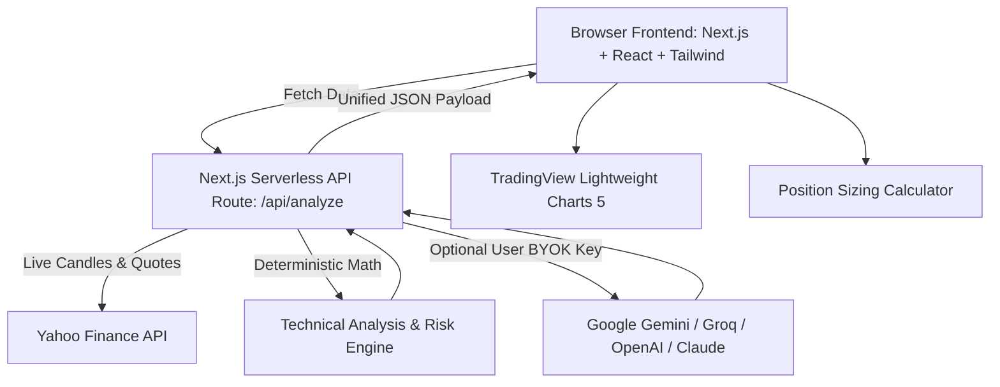

# 📈 IDX Swing Analyzer & Trading Copilot

<div align="center">


### Platform Analisis Swing Trading Saham Indonesia (IHSG / BEI) Modern & AI Copilot Bertenaga BYOK

[](https://stock-analyzer-laf.vercel.app/)
[](https://github.com/labibaf/stock-analyzer)
[](https://nextjs.org/)
[](https://www.typescriptlang.org/)
[](LICENSE)

**[🌐 Buka Aplikasi Live Demo](https://stock-analyzer-laf.vercel.app/)** • **[⭐ Beri Bintang di GitHub](https://github.com/labibaf/stock-analyzer)**

</div>

---

## 📖 Tentang Project

**IDX Swing Analyzer** adalah aplikasi web *open-source* yang dirancang khusus untuk mempermudah trader saham di **Bursa Efek Indonesia (BEI / IHSG)** dalam merencanakan swing trading secara presisi, objektif, dan terukur.

Aplikasi ini menggabungkan **Engine Kalkulasi Teknis Deterministik (100% Matematika)** dengan **AI Copilot Synthesis** berbasis arsitektur **Bring Your Own Key (BYOK)**, sehingga pengguna dapat menghubungkan API Key AI pilihan mereka sendiri secara aman dan gratis tanpa membebani server *host*.

---

## ✨ Fitur Unggulan

### 1. 🎯 Plan Swing Trading & Dynamic Time Horizon
- Menghitung **Area Beli (*Buy Zone*)**, **Target Profit 1 (TP1)**, **Target Profit 2 (TP2)**, dan level **Stop Loss (*Cut Loss*)** objektif berbasis level *Support/Resistance* dan volatilitas harian (*ATR 14*).
- **Dynamic Time Horizon**: Durasi perkiraan *holding period* dihitung matematis berdasarkan jarak target dan tipe setup (contoh: `3 - 7 hari bursa (Fast Momentum)`, `5 - 12 hari (Pullback)`, `8 - 18 hari (Base Breakout)`).

### 2. 🎚️ Kalkulator Manajemen Lot & Risiko Portofolio
- **Mode Otomatis (Berdasar Risiko)**: Menentukan jumlah lot ideal berdasarkan toleransi risiko per trade (0.1% - 20%) dan secara otomatis dikunci maksimal **100% modal tunai (*Cash Buying Power*)** agar terhindar dari *over-trading*.
- **Mode Manual (Input Lot)**: Stepper lot interaktif dengan estimasi skenario cut loss/target profit bersih serta simulasi fee broker IDX (~0.15% beli, 0.25% jual).

### 3. 📊 Konsensus Sinyal Indikator (11 Indikator)
- Rangkuman sinyal deterministik terverifikasi: **🟢 BUY**, **⚪ NEUTRAL**, **🔴 SELL**.
- *Visual Bar Meter* (TradingView Style) merangkum 11 indikator: **EMA 20, EMA 50, EMA 200, MA Trend Alignment, RSI 14, Stochastic (14,3,3), MACD, Money Flow Index (MFI 14), Bollinger Bands, Volume Surge, dan Pola Candlestick**.

### 4. 🕯️ Interactive TradingView Multi-Timeframe Chart
- Chart candlestick interaktif berkecepatan tinggi dengan dukungan multi-timeframe:
  - **`15m`** (Intraday Momentum)
  - **`1h`** (Short-term Swing)
  - **`1D`** (Harian / Primary Swing)
  - **`1W`** (Mingguan / Major Trend)
  - **`1M`** (Bulanan / Macro Structure)
- Dilengkapi overlay **EMA 20, EMA 50, EMA 200, Bollinger Bands 20,2 (dengan indikator Volatility Squeeze)**, serta garis penanda level SL dan TP.

### 5. 🤖 AI Model (Bring Your Own Key - BYOK)
- Pengguna dapat memasukkan API Key AI pribadi mereka langsung di aplikasi.
- **Provider AI yang didukung:**
  - 🟢 **Google Gemini** (Free Tier): `gemini-2.5-flash`, `gemini-2.5-pro`, `gemini-2.0-flash`
  - ⚡ **Groq Cloud** (Free Tier): `llama-3.3-70b-versatile`, `deepseek-r1-distill-llama-70b`
  - 🌐 **OpenRouter**: `deepseek/deepseek-chat`, `meta-llama/llama-3.3-70b`
  - 🤖 **OpenAI**: `gpt-4o-mini`, `gpt-4o`, `o3-mini`
  - 🧠 **Anthropic Claude**: `claude-3-7-sonnet-latest`, `claude-3-5-haiku-latest`
- 🔒 **100% Aman**: API Key hanya tersimpan di `localStorage` browser pengguna, tidak pernah dikirim ke database pihak ketiga.
- 🛡️ **Algorithmic Fallback**: Aplikasi tetap berfungsi 100% normal meskipun tanpa API Key AI.

---

## 🛠️ Arsitektur & Tech Stack



- **Framework**: [Next.js 16 (App Router + Turbopack)](https://nextjs.org/)
- **Language**: [TypeScript 5](https://www.typescriptlang.org/)
- **Styling**: [Tailwind CSS 4](https://tailwindcss.com/)
- **Charting**: [TradingView Lightweight Charts 5](https://tradingview.github.io/lightweight-charts/)
- **Market Data Engine**: Yahoo Finance (`yahoo-finance2`)
- **Icons**: [Lucide React](https://lucide.dev/)

---

## 💻 Panduan Menjalankan di Komputer Lokal

### Prasyarat
- [Node.js](https://nodejs.org/) versi 18.18 atau lebih baru.
- npm / yarn / pnpm / bun.

### Langkah Instalasi

1. **Clone repository ini:**
   ```bash
   git clone https://github.com/labibaf/stock-analyzer.git
   cd stock-analyzer
   ```

2. **Install dependensi:**
   ```bash
   npm install
   ```

3. **Jalankan development server:**
   ```bash
   npm run dev
   ```

4. **Buka di browser:**
   Akses `http://localhost:3000`.

5. **Build untuk produksi:**
   ```bash
   npm run build
   npm run start
   ```

---

## 🤝 Kontribusi (Contributing)

Kontribusi sangat disambut baik! Jika kamu ingin menambahkan fitur baru, memperbaiki bug, atau meningkatkan algoritma analisis:

1. Fork repository ini: [github.com/labibaf/stock-analyzer](https://github.com/labibaf/stock-analyzer)
2. Buat branch fitur baru (`git checkout -b feature/FiturKeren`)
3. Commit perubahanmu (`git commit -m 'feat: tambah fitur keren'`)
4. Push ke branch (`git push origin feature/FiturKeren`)
5. Buka **Pull Request** di GitHub.

---

## 📄 Lisensi

Project ini dilisensikan di bawah lisensi [MIT License](LICENSE) — bebas digunakan, dimodifikasi, dan dikembangkan kembali untuk keperluan pribadi maupun komersial.

---

## 👤 Author & Creator

Dibuat dengan ❤️ oleh **LabibAF ([@labibaf](https://github.com/labibaf))**.

- 🌐 Live App: [stock-analyzer-laf.vercel.app](https://stock-analyzer-laf.vercel.app/)
- 🐙 GitHub: [github.com/labibaf](https://github.com/labibaf)

---

## ⚠️ Disclaimer Finansial

Aplikasi ini dikembangkan untuk **tujuan edukasi, riset, dan alat bantu kalkulasi teknikal saham semata**. Seluruh data harga, skenario swing, dan rekomendasi yang dihasilkan bukanlah ajakan mutlak untuk membeli atau menjual instrumen finansial tertentu. Segala keputusan transaksi pasar modal sepenuhnya merupakan tanggung jawab masing-masing individu (*Do Your Own Research / DYOR*).
