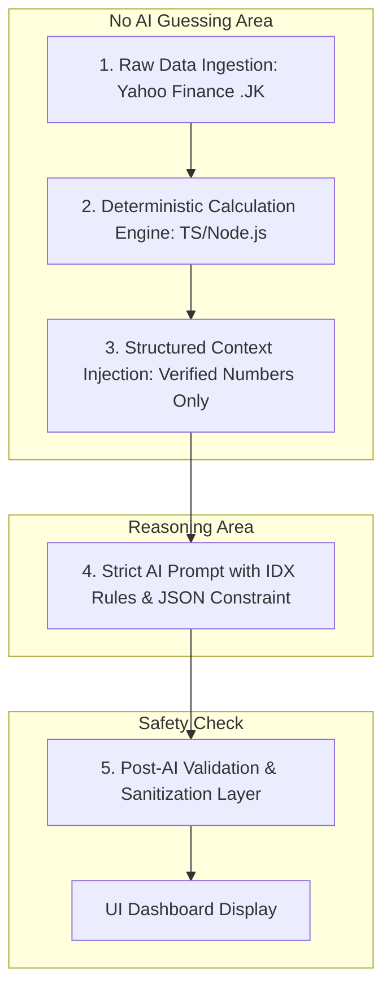

# 📑 IDX Swing Analyzer: Architecture & Anti-Hallucination Specification

Dokumen ini merupakan panduan spesifikasi arsitektur teknis, aturan pasar modal Indonesia (IDX / BEI), metodologi kalkulasi teknikal, serta protokol **Anti-Halusinasi (Anti-Hallucination Framework)** untuk aplikasi **IDX Swing Analyzer**.

---

## 1. 🎯 Tujuan & Cakupan Aplikasi

* **Tujuan**: Memberikan analisis dan rencana *Swing Trading* (holding period 3 - 15 hari bursa) yang objektif, berbasis data nyata, dan bebas dari halusinasi untuk saham-saham di Bursa Efek Indonesia (IDX/IHSG).
* **Fokus Pasar**: Saham terdaftar di BEI (Kode 4 huruf alfabet, e.g., `BBCA`, `BBRI`, `MEDC`, `ADRO`, `AMMN`).
* **Pendekatan Analisis**: 
  1. **Deterministic Calculation** (Algoritma matematika untuk kalkulasi indikator & level kunci).
  2. **AI Reasoning & Synthesis** (Google Gemini Free Tier / LLM bertindak sebagai analis narasi dan sintesis, **bukan** penyedia data mentah).

---

## 2. 🛡️ Anti-Hallucination Framework (Prinsip Anti-Halu)

Penyebab utama AI mengalami halusinasi (*hallucination*) dalam analisis saham adalah **ketika AI diminta menebak harga, mencari data sendiri dari pengetahuannya yang sudah kedaluwarsa (*outdated cutoff*), atau diberikan prompt yang ambigu tanpa batasan numerik**.

Aplikasi ini menerapkan **5 Lapis Proteksi Anti-Halusinasi**:



### 5 Lapis Proteksi:
1. **Lapis 1: Hard Grounding (No Data Generation by AI)**
   * AI **dilarang keras** menyediakan harga saham, tanggal, volume, atau nilai indikator historis.
   * Seluruh data harga harian (OHLCV) ditarik langsung dari sumber data terverifikasi (Yahoo Finance `.JK`) secara *real-time/server-side*.
2. **Lapis 2: Deterministic Technical Engine**
   * Semua kalkulasi teknikal (EMA, RSI, MACD, Support, Resistance, ATR, Volume Spike) dihitung secara presisi menggunakan formula matematika baku di backend sebelum menyentuh AI.
3. **Lapis 3: Structured Context Injection (RAG-lite)**
   * Data yang dikirim ke AI adalah hasil kalkulasi pasti dalam format terstruktur (JSON):
     - `current_price`, `previous_close`, `change_pct`
     - `ema_20`, `ema_50`, `ema_200`, `trend_status`
     - `rsi_14`, `macd_status`, `volume_ratio_to_20sma`
     - `support_1`, `support_2`, `resistance_1`, `resistance_2`
     - `atr_14`, `suggested_sl_math`, `suggested_tp_math`
4. **Lapis 4: Strict IDX Domain Knowledge in System Prompt**
   * AI diinstruksikan dengan aturan pasar modal Indonesia (Fraksi Harga BEI, batas ARA/ARB, lot size 100 lembar).
   * AI diwajibkan menggunakan batas-batas level matematika yang sudah dihitung server, bukan mengarang angka sembarangan.
5. **Lapis 5: Output Validation & Fallback Algoritmik**
   * Backend melakukan sanitasi (*sanity check*):
     - Pastikan `Target Price > Current Price` (untuk posisi Buy/Long).
     - Pastikan `Stop Loss < Current Price`.
     - Pastikan `Risk-to-Reward Ratio >= 1:1.5`.
   * Jika AI gagal merespons, limit kuota habis, atau formatnya invalid, sistem otomatis menggunakan **Algorithmic Fallback Engine** tanpa jeda atau downtime.

---

## 3. 🇮🇩 Aturan Khusus Bursa Efek Indonesia (IDX Rules)

Agar rekomendasi harga logis dan dapat dieksekusi di aplikasi sekuritas (IPOT, Stockbit, Mandiri Sekuritas, Mirae, dll.), sistem mematuhi aturan fraksi harga BEI:

### Tabel Fraksi Harga (Tick Size) BEI:
| Rentang Harga (Rp) | Fraksi (Tick) | Maksimum Perubahan Per Langkah |
|---|---|---|
| **< Rp 200** | **Rp 1** | Contoh: 100, 101, 102 |
| **Rp 200 – < Rp 500** | **Rp 2** | Contoh: 200, 202, 204 |
| **Rp 500 – < Rp 2.000** | **Rp 5** | Contoh: 500, 505, 510 |
| **Rp 2.000 – < Rp 5.000** | **Rp 10** | Contoh: 2.000, 2.010, 2.020 |
| **>= Rp 5.000** | **Rp 25** | Contoh: 5.000, 5.025, 5.050 |

*Helper function `roundToIDXTick(price)` akan otomatis membulatkan semua target harga, entry, dan stop loss ke fraksi yang valid.*

---

## 4. 📈 Metodologi Swing Trading & Kalkulasi Indikator

### A. Indikator Wajib:
1. **Trend Identification (Exponential Moving Average)**:
   * **EMA 20** (Short-term trend / Swing baseline)
   * **EMA 50** (Medium-term trend)
   * **EMA 200** (Long-term baseline / Major trend)
   * *Status Tren*:
     - **Strong Uptrend**: Price > EMA 20 > EMA 50 > EMA 200
     - **Pullback in Uptrend**: Price testing EMA 20/50 while EMA 50 > EMA 200
     - **Consolidation / Sideways**: Moving averages flat & berdekatan
     - **Downtrend**: Price < EMA 50 < EMA 200 (Hindari swing buy kecuali *oversold bounce*)
2. **Momentum (RSI 14)**:
   * RSI < 30: *Oversold* (Peluang Technical Rebound)
   * RSI 40 - 60: *Healthy Bullish Zone* (Ideal untuk Pullback Buy)
   * RSI > 70: *Overbought* (Waspada profit taking)
3. **Volume Confirmation**:
   * **Volume Ratio** = `Volume Hari Ini / SMA(Volume, 20)`
   * Ratio > 1.5x: *High Volume Confirmation / Smart Money presence*
   * Ratio < 0.7x: *Low Volume Consolidation*
4. **Dynamic Risk (ATR 14 - Average True Range)**:
   * Mengukur volatilitas harian saham untuk menentukan jarak *Stop Loss* yang rasional (menghindari terkena *noise* atau *whipsaw*).
   * Formula Stop Loss: $\text{SL} = \text{Support Terdekat} - (0.5 \times \text{ATR})$

### B. Taksonomi Setup Swing Trading:
1. **Setup 1: EMA 20/50 Pullback (Trend Following)**
   * *Kondisi*: Saham dalam Uptrend sehat, harga terkoreksi dengan volume mengecil menguji area EMA 20 atau EMA 50, RSI berada di 40-55.
2. **Setup 2: Resistance Breakout with High Volume**
   * *Kondisi*: Harga menembus level *Swing High / Resistance* sebelumnya dengan volume > 1.5x rata-rata 20 hari.
3. **Setup 3: Support Bounce (Range Trading)**
   * *Kondisi*: Harga memantul di area support kuat dengan candle pembalikan (*Hammer, Bullish Engulfing*).
4. **Setup 4: Oversold Reversal (Counter-Trend)**
   * *Kondisi*: RSI < 30, divergence positif antara RSI dan harga di area support mayor.

---

## 5. 🤖 Spesifikasi System Prompt AI (Google Gemini Free)

Prompt dirancang dengan prinsip **Role-Based, Strict Constraints, and Structured Output**:

```markdown
SYSTEM PROMPT:
Anda adalah "IDX Pro Swing Analyst", seorang analis teknikal swing trading profesional khusus saham Bursa Efek Indonesia (IDX / BEI).

TUGAS ANDA:
Menganalisis data teknikal yang TELAH DISEDIAKAN oleh sistem server secara objektif, menyusun narasi trading thesis, dan memberikan action plan swing trade (holding period 3-15 hari bursa).

ATURAN ANTI-HALUSINASI KETAT:
1. JANGAN PERNAH mengarang data harga, volume, atau metrik yang tidak ada dalam JSON context.
2. Semua angka harga (Entry, Target 1, Target 2, Stop Loss) HARUS konsisten dengan support/resistance dan fraksi harga BEI yang diberikan.
3. Selalu prioritaskan Risk Management: Risk-to-Reward ratio minimal 1:1.5. Stop loss wajib dicantumkan dan harus logis (< Entry Price).
4. Bahasa yang digunakan adalah Bahasa Indonesia profesional, ringkas, lugas, dan actionable untuk trader lokal.
5. Jika saham sedang dalam kondisi Downtrend parah (Strong Downtrend) tanpa sinyal pembalikan, rekomendasikan "WAIT AND SEE" atau "AVOID".

FORMAT OUTPUT JSON:
{
  "recommendation": "BUY_ON_WEAKNESS" | "BUY_ON_BREAKOUT" | "WAIT_AND_SEE" | "SELL_ON_STRENGTH",
  "swing_setup_name": "string",
  "confidence_score": 1-100,
  "trading_thesis": "string (2-3 kalimat penjelasan ringkas momentum dan struktur chart)",
  "action_plan": {
    "buy_zone": "string (contoh: 1850 - 1880)",
    "target_price_1": number,
    "target_price_2": number,
    "stop_loss": number,
    "risk_reward_ratio": "string (contoh: 1:2.3)",
    "estimated_holding_days": "string (contoh: 5-10 hari)"
  },
  "key_catalysts_or_risks": [
    "string"
  ]
}
```

---

## 6. 🏗️ Tech Stack & Deployment Architecture

* **Framework**: Next.js 15+ (App Router, Server Actions / Route Handlers, TypeScript).
* **Styling**: Tailwind CSS, Lucide React Icons.
* **Charting**: TradingView Lightweight Charts (`lightweight-charts`) — Canvas-based, responsif, zero latency.
* **Data Fetcher**: `yahoo-finance2` (Node.js/Serverless compatible, support `TICKER.JK`).
* **AI Provider**: Google Gemini Flash API (`@google/genai` atau `@google/generative-ai`) via Google AI Studio Free Tier.
* **Hosting**: Vercel (Hobby Tier - 100% Free).

---

## 7. 🧪 Testing & Validation Checklist

Sebelum rilis, modul akan diuji terhadap:
- [x] Kode saham populer berbagai fraksi (misal: GOTO fraksi 1, BBRI fraksi 10, ASII fraksi 25).
- [x] Skenario jika Gemini API Key belum diisi (aplikasi tetap jalan mulus via Algorithmic Engine).
- [x] Pembulatan fraksi harga (Tick Size) selalu presisi sesuai aturan BEI.
- [x] Responsivitas tampilan di layar Desktop dan Mobile/Smartphone.
